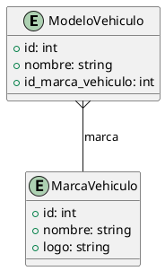

### Documentación de la API para el Modelo `MarcaVehiculo` y `ModeloVehiculo`

A continuación se detallan los endpoints desarrollados para la gestión de las marcas de vehículos.

---

### Endpoints - `MarcaVehiculo`

#### 1. **Listar Marcas de Vehículos**
   - **Ruta**: `/marcas_vehiculos/`
   - **Método**: `GET`
   - **Descripción**: Retorna una lista de todas las marcas de vehículos en formato JSON.
   - **Parámetros**: Ninguno.
   - **Respuesta (200 OK)**: 
     ```json
     [
       {
         "id": 1,
         "nombre": "Toyota",
         "logo": "https://url-del-logo.com/toyota-logo.png"
       },
       ...
     ]
     ```
   - **Errores**: Ninguno. 

---

#### 2. **Registrar una Nueva Marca de Vehículo**
   - **Ruta**: `/marcas_vehiculos/`
   - **Método**: `POST`
   - **Descripción**: Registra una nueva marca de vehículo utilizando los datos enviados en el cuerpo de la petición en formato JSON.
   - **Parámetros (JSON)**:
     - `nombre` (str): Nombre de la marca de vehículo.
     - `logo` (str): URL del logo de la marca.
   - **Ejemplo JSON de Solicitud**:
     ```json
     {
       "nombre": "Chevrolet",
       "logo": "https://url-del-logo.com/chevrolet-logo.png"
     }
     ```
   - **Respuesta (200 OK)**: Una lista con todas las marcas de vehículos, incluyendo la nueva marca creada.
   - **Errores**: 
     - Si los datos están incompletos o en formato incorrecto, se puede devolver un error `400 Bad Request`.

---

#### 3. **Actualizar una Marca de Vehículo**
   - **Ruta**: `/marcas_vehiculos/<int:id>`
   - **Método**: `PUT`
   - **Descripción**: Actualiza los datos de una marca de vehículo existente.
   - **Parámetros (JSON)**:
     - `nombre` (str, opcional): Nuevo nombre de la marca.
     - `logo` (str, opcional): Nuevo logo de la marca.
   - **Parámetros de Ruta**:
     - `id`: El identificador único de la marca de vehículo a modificar.
   - **Ejemplo JSON de Solicitud**:
     ```json
     {
       "nombre": "Ford",
       "logo": "https://url-del-logo.com/ford-logo.png"
     }
     ```
   - **Respuesta (200 OK)**: Una lista con todas las marcas de vehículos actualizadas.
   - **Errores**: 
     - `404 Not Found`: Si la marca con el ID especificado no se encuentra en la base de datos.

---

### Diagrama de entidad (ModeloVehiculo)

A continuación se presenta el diagrama de entidad que describe la relación entre los modelos y las marcas de vehículos, en formato PlantUML:



### Explicación del Diagrama
- La entidad **ModeloVehiculo** representa un modelo de automóvil y está compuesta por los siguientes atributos:
  - `id`: Identificador único del modelo de vehículo.
  - `nombre`: Nombre del modelo del vehículo (Ej.: "Corolla").
  - `id_marca_vehiculo`: Relación con la entidad `MarcaVehiculo`, que indica a qué marca pertenece este modelo.

- La entidad **MarcaVehiculo** representa la marca (fabricante) del vehículo. Los atributos son:
  - `id`: Identificador único de la marca.
  - `nombre`: Nombre de la marca de los vehículos (Ej.: "Toyota").
  - `logo`: URL de la imagen del logotipo de la marca.

En resumen, **una marca puede tener muchos modelos** de vehículos, y un modelo específico pertenece a una única marca.
<!-- @import "[TOC]" {cmd="toc" depthFrom=1 depthTo=6 orderedList=false} -->
