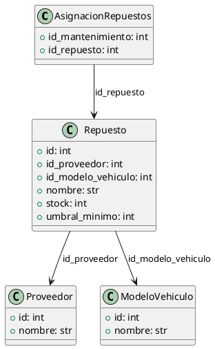

### Documentación de la API - Gestión de Repuestos

#### Descripción General
Esta API permite gestionar los repuestos utilizados en el sistema. A través de los diferentes endpoints, los desarrolladores de frontend pueden realizar operaciones básicas como listar, agregar y eliminar repuestos. A continuación, se describe cada ruta, los verbos HTTP asociados, los parámetros, y los modelos de datos involucrados.

---

### **Rutas de la API**

---

#### 1. **Listar Repuestos**

- **Método HTTP**: `GET`
- **Ruta**: `/repuestos/`
    
- **Descripción**: 
  Obtiene una lista de todos los repuestos registrados en el sistema.

- **Parámetros**: 
  Ninguno, este endpoint no requiere parámetros.

- **Devuelve**:
  Un `JSON Array` con la lista completa de repuestos. Cada elemento contiene los siguientes atributos:
  
  ```json
  [
    {
      "id": 1,
      "proveedor": {
        "id": 10,
        "nombre": "Proveedor A"
      },
      "modelo_vehiculo": {
        "id": 5,
        "nombre": "Modelo Vehículo X"
      },
      "nombre": "Filtro de aceite",
      "stock": 10,
      "umbral_minimo": 2
    },
    ...
  ]
  ```
  
- **Posibles respuestas**:
  - **200 OK**: Devuelve la lista de repuestos en formato JSON.

---

#### 2. **Alta de Repuesto**

- **Método HTTP**: `POST`
- **Ruta**: `/repuestos/`
    
- **Descripción**: 
  Agrega un nuevo repuesto en el sistema.

- **Parámetros** (en el body de la solicitud, en formato `JSON`):

  ```json
  {
    "id_proveedor": int,
    "id_modelo_vehiculo": int,
    "nombre": string,
    "stock": int,
    "umbral_minimo": int
  }
  ```
    
- **Devuelve**:
  Un `JSON Array` con la lista actualizada de repuestos después de insertar el nuevo registro.
  
- **Posibles respuestas**:
  - **200 OK**: Devuelve la lista de repuestos actualizada.
  - **400 Bad Request**: Si faltan campos necesarios en el cuerpo de la solicitud, devolverá un error de validación.

---

#### 3. **Eliminar Repuesto**

- **Método HTTP**: `DELETE`
- **Ruta**: `/repuestos/<int:id>`
    
- **Descripción**: 
  Elimina el repuesto identificado por un ID.

- **Parámetros**:

  - **`id`** (_en la URL_): Entero que representa el identificador único del repuesto que se desea eliminar.
  
- **Devuelve**:
  Un `JSON Array` con la lista actualizada de repuestos tras eliminar el solicitado. Si el repuesto no se encuentra, devuelve un estado de error.
  
- **Posibles respuestas**:
  - **200 OK**: Devuelve la lista de repuestos actualizada.
  - **404 Not Found**: Devuelve un mensaje indicando que el repuesto no se encontró, si el `id` no existe.

---

### **Modelo de Datos**

A continuación se presenta el modelo de datos para la entidad **Repuesto**. Este modelo es la representación de un repuesto en el sistema y tiene las siguientes propiedades:

- **id**: Identificador único del repuesto.
- **id_proveedor**: Identificador del proveedor.
- **id_modelo_vehiculo**: Identificador del modelo de vehículo al que pertenece el repuesto.
- **nombre**: Nombre del repuesto.
- **stock**: Cantidad actual disponible del repuesto.
- **umbral_minimo**: Umbral mínimo de stock para el repuesto.

---

### **Diagrama de Entidad - PlatUML**

Se muestra el diagrama de entidad modelado en PlatUML.



---

### Observaciones

- **Transacciones atómicas**: Cada transacción al agregar o eliminar repuestos es atómica, es decir, incluyen `db.session.commit()` para asegurar que sólo se comprometa la operación si no hay errores.
- **Serialización**: Se utilizan métodos de serialización sobre los modelos de datos para devolver respuestas JSON legibles. Estos campos permiten retornar información compleja como las relaciones con el modelo del vehículo y los proveedores asociados.