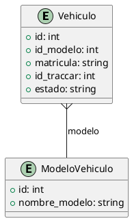

### Documentación de la API para el Modelo "Vehiculo"

### Endpoints

#### 1. **Listar Vehículos**

- **Ruta**: `/vehiculos`
- **Método**: `GET`
- **Descripción**: Devuelve una lista de todos los vehículos en formato JSON.
- **Parámetros**: Ninguno.
- **Respuesta (200 OK)**:

     ```json
     [
       {
         "id": 1,
         "modelo": { ... },
         "matricula": "ABC123",
         "id_traccar": 12345,
         "estado": "Activo"
       },
       ...
     ]
     ```

- **Errores**: Ninguno.

---

#### 2. **Registrar un Vehículo**

- **Ruta**: `/vehiculos/alta`
- **Método**: `GET`, `POST`
- **Descripción**:
  - `GET`: Devuelve un formulario en HTML para la carga de datos de un nuevo vehículo.
  - `POST`: Procesa los datos enviados desde el formulario para crear y almacenar un vehículo.
- **Parámetros (Formulario POST)**:
  - `marca` (str)
  - `modelo` (str)
  - `patente` (str)
  - `anio` (int)
- **Validaciones**: Verifica que la patente no esté duplicada, utilizando el método `Valida.patente(patente)` y comparando con vehículos existentes en la base de datos.
- **Respuesta (POST)**:
  - Si se procesa correctamente, un mensaje de éxito se mostrará.
  - Si la patente ya está en la base de datos, devuelve un mensaje indicando la duplicidad.
- **Errores**:
  - Sin procesamiento en backend cuando los datos se envían mal.
  - Duplicidad de patente.

---

#### 3. **Modificar un Vehículo**

- **Ruta**: `/vehiculos/mod`
- **Método**: `PUT`
- **Descripción**: Modifica los datos de un vehículo existente en el sistema.
- **Parámetros**:
  - `marca` (str): Nueva marca del vehículo.
  - `modelo` (str): Nuevo modelo del vehículo.
  - `anio` (int): Nuevo año del vehículo.
  - `patente` (str): Patente del vehículo a ser modificada.
- **Respuesta (200 OK)**: Mensaje de éxito indicando que el vehículo fue modificado.
- **Errores**:
  - Vehículo no encontrado si no existe una coincidencia con la patente proporcionada.

---

#### 4. **Dar de Baja un Vehículo**

- **Ruta**: `/vehiculos/baja`
- **Método**: `GET`
- **Descripción**: Cambia el estado de un vehículo existente a "Baja".
- **Parámetros (vía Formulario)**:
  - `patente` (str): Patente del vehículo a dar de baja.
- **Respuesta (200 OK)**: Mensaje de éxito indicando que el vehículo fue dado de baja.
- **Errores**:
  - Vehículo no encontrado si no existe una coincidencia con la patente proporcionada.

### Diagrama de entidad (Vehículo)

A continuación se presenta el diagrama de entidad para "Vehículo" en formato PlantUML:



### Explicación del Diagrama

- La entidad **Vehículo** tiene los siguientes atributos:
  - `id`: Identificador único del vehículo.
  - `id_modelo`: Relación con la entidad `ModeloVehiculo`.
  - `matricula`: Número de matrícula (patente) del vehículo.
  - `id_traccar`: ID asociado al sistema de geoposicionamiento Traccar.
  - `estado`: Estado actual del vehículo (ej. Activo, Baja).

- La entidad **ModeloVehiculo** representa el modelo específico del vehículo e incluye atributos como:
  - `id`: Identificador único del modelo.
  - `nombre_modelo`: Nombre específico del modelo del vehículo.
