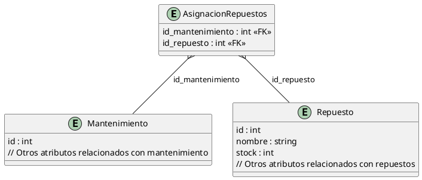

### Endpoint 1: Listar Repuestos
**Ruta:** `GET /repuestos/`

**Verbo HTTP:** `GET`

**Descripción:** Este endpoint devuelve la lista de todos los repuestos disponibles en el sistema en formato JSON.

**Parámetros:** Ninguno.

**Respuesta:**
- **Código 200 (OK):** Retorna un JSON con la lista de repuestos.

```json
[
  {
    "id": 1,
    "nombre": "Filtro de Aceite",
    "stock": 5,
    ...
  },
  {
    "id": 2,
    "nombre": "Pastilla de Freno",
    "stock": 10,
    ...
  }
]
```

### Endpoint 2: Alta de un Repuesto
**Ruta:** `POST /repuestos/`

**Verbo HTTP:** `POST`

**Descripción:** Este endpoint permite registrar un nuevo repuesto en el sistema. El repuesto se pasa en el cuerpo de la petición en formato JSON.

**Parámetros:**
1. **Cuerpo de la solicitud:** Debe contener un JSON con las propiedades necesarias para crear el repuesto. El formato dependerá del modelo de datos del repuesto.

**Ejemplo del cuerpo de la solicitud:**

```json
{
  "nombre": "Filtro de aire",
  "stock": 20,
  // otros atributos relevantes del repuesto
}
```

**Respuesta:**
- **Código 200 (OK):** Devuelve un JSON con la nueva lista de repuestos, que incluye el recientemente agregado:
```json
[
  {
    "id": 1,
    "nombre": "Filtro de Aceite",
    "stock": 5,
    ...
  },
  {
    "id": 2,
    "nombre": "Filtro de Aire",
    "stock": 20,
    ...
  }
]
```
- **Código 400 (Bad Request):** Si la solicitud está malformada o faltan datos obligatorios.

### Endpoint 3: Baja de un Repuesto
**Ruta:** `DELETE /repuestos/<int:id>`

**Verbo HTTP:** `DELETE`

**Descripción:** Este endpoint permite eliminar un repuesto del sistema mediante su ID.

**Parámetros:**
1. **id:** (En la ruta) Especifica qué repuesto se eliminará mediante su identificador único (entero).

**Respuesta:**
- **Código 200 (OK):** Devuelve la lista actualizada de repuestos después de eliminar el repuesto especificado.
  
```json
[
  {
    "id": 1,
    "nombre": "Filtro de Aceite",
    "stock": 5,
    ...
  }
]
```

- **Código 404 (Not Found):** Si el ID proporcionado no corresponde a ningún repuesto existente en la base de datos:
```json
"Repuesto no encontrado"
```

## Diagrama del Modelo `AsignacionRepuestos`

El modelo `AsignacionRepuestos` es una tabla de relación que asigna repuestos a un mantenimiento específico. Está compuesto por dos claves foráneas: `id_mantenimiento` y `id_repuesto`, las cuales hacen referencia a las tablas `mantenimiento` y `repuesto`, respectivamente. Ambas claves también sirven como claves primarias compuestas.

A continuación, presentamos el diagrama de esta entidad en notation PlantUML:



### Descripción del diagrama:
- En esta representación, `AsignacionRepuestos` es una tabla relacional que vincula registros de `Mantenimiento` y `Repuesto`.
- La relación está indicada con llaves foráneas: `id_mantenimiento` y `id_repuesto`.
- Las relaciones están representadas en el diagrama con líneas que conectan los modelos.

---

Esta documentación será de utilidad para los desarrolladores de frontend, ya que les proporcionará la información necesaria para interactuar correctamente con la API para el manejo de repuestos en el sistema de gestión de flotas de vehículos.